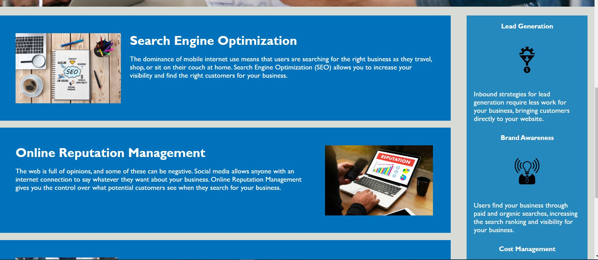
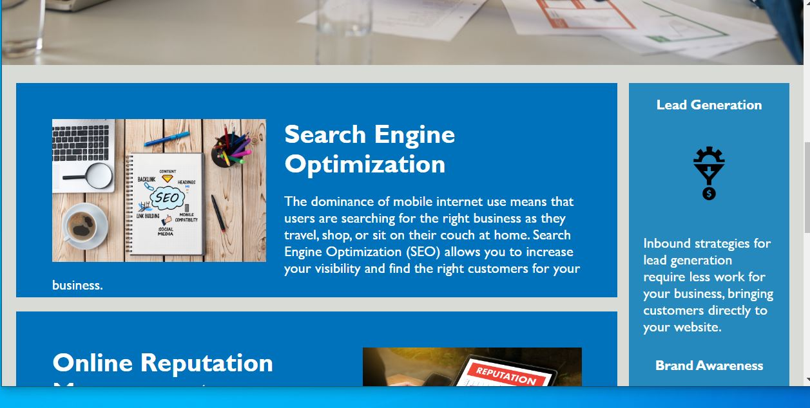

# Challenge #1
# HoriSEOn
Challenge from HTML-CSS-Git Module 1

Webpage is an introduction/explanatory page for company services.  Stand alone page with no external linkage or information input blocks at this time. 
Refactoring given code for Horiseon web page for accessiblity puposes.

**index.html**
================
*List of changes:*
1. Added direct definition of the style of the text 'seo' in the page company name. Also changed color for readibility.
2. Moved id for info box `images directly into the image source line, to allow the use of common information class. (related changes in CSS).
3. Added 'alt' text for images.
4. Changed all individual class names for info boxes into single class.
5. Changed all individual class names for benefit bar into a single class.

**css.style**
==============
*List of changes:*
1. Combined the 3 seperate class service 'info' text box classes into single version for reuse for all 3 services.
2. Changed the 3 image sizing classes into a single class definition.
3. Combined the 3 info headers into a single header class definition.
4. Combined the 3 benefit bar headers into a single class definitions.

**Resizing**
This website will resize both the images and layout as necessary for smaller width browser windows.

## Browser Wide View ##

## Browser Narrow View

### GitHub Repository URL: https://github.com/AeroRider66/butter_project1 ###

### Deployed URL: https://aerorider66.github.io/butter_project1/ ###

## License

[MIT](https://choosealicense.com/licenses/mit/)